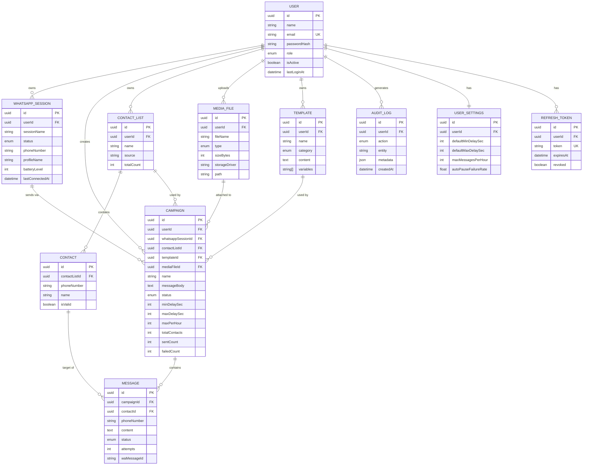

# Entity Relationship Diagram — iNaedaa Blast

## Catatan Desain

- **WhatsAppSession** dipisah dari `User` agar satu user dapat memiliki lebih dari satu sesi WA di masa depan (multi-device / multi-nomor), meski MVP membatasi 1 sesi aktif per user.
- **ContactList** dan **Contact** dipisah dari `Campaign` agar daftar kontak dapat dipakai ulang di beberapa campaign.
- **Message** adalah entity granular per-nomor per-campaign — ini yang menjadi basis progress realtime, retry, dan laporan delivery/failure rate.
- **AuditLog** mencatat aksi sensitif (login, start/pause campaign, connect WA, import kontak, export laporan) untuk keperluan keamanan & compliance.
- Semua status memakai enum Postgres native via Prisma agar konsisten dan bisa diindeks.
